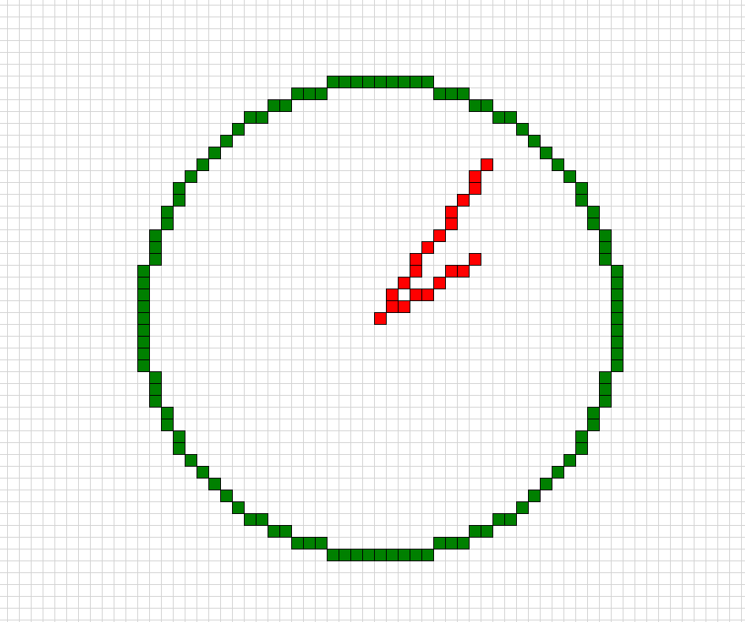

# 🖋️ Bresenham Drawing Visualizer

This project is a graphical implementation of **Bresenham's Line and Circle Drawing Algorithms** using Python's `turtle` module. It allows you to visually trace lines and circles pixel by pixel, simulating how they would be drawn on a raster display.

---

## 📌 Features

- Draw **lines** using the efficient Bresenham line algorithm
- Draw **circles** using Bresenham’s midpoint circle algorithm
- Interactive graphical visualization with **grid background**
- Customizable **square size** and **colors**
- Full-window drawing canvas with coordinate grid

---

## 📂 Project Structure

```

📁 bresenham-visualizer/
├── bresenham.py     # Core algorithms (Point, Line, Circle)
├── graphics.py      # Drawing utilities using turtle
├── main.py          # Application entry point
└── README.md        # This file

````

---

## 🧪 Demo



> ✅ Screenshot of a sample output drawing multiple lines and a circle on a grid canvas.

---

## 🚀 How to Run

### ✅ Requirements

- Python 3.x (tested on 3.10+)
- No additional packages required (uses built-in `turtle` module)

### ▶️ Run the Program

```bash
git clone https://github.com/Soufiane-JADDA/bresenham-visualizer.git
cd bresenham-visualizer
python main.py
````

> 🐢 A turtle graphics window will open showing the line and circle drawing process.

---

## ✏️ Example Output

The `main.py` script draws:

* A line from `(0, 0)` to `(8, 5)`
* A line from `(0, 0)` to `(9, 13)`
* A circle of radius `20` centered at `(0, 0)`

---

## 🧠 What is Bresenham's Algorithm?

Bresenham’s algorithms are used in computer graphics to draw lines and circles efficiently using only integer operations. They’re widely used in:

* Raster image generation
* 2D game engines
* Embedded systems displays

---

## 🛠️ Customization

In `main.py`, you can modify:

```python
gfx = Graphics(square_size=15)  # Change the grid size
gfx.draw_line(Point(0, 0), Point(8, 5), color='blue')
gfx.draw_circle(Point(0, 0), 20, color='green')
```

---

## 👤 Author

**Soufiane JADDA**

* 🎓 Data Science Student
* 🔗 [GitHub Profile](https://github.com/Soufiane-JADDA)

---
